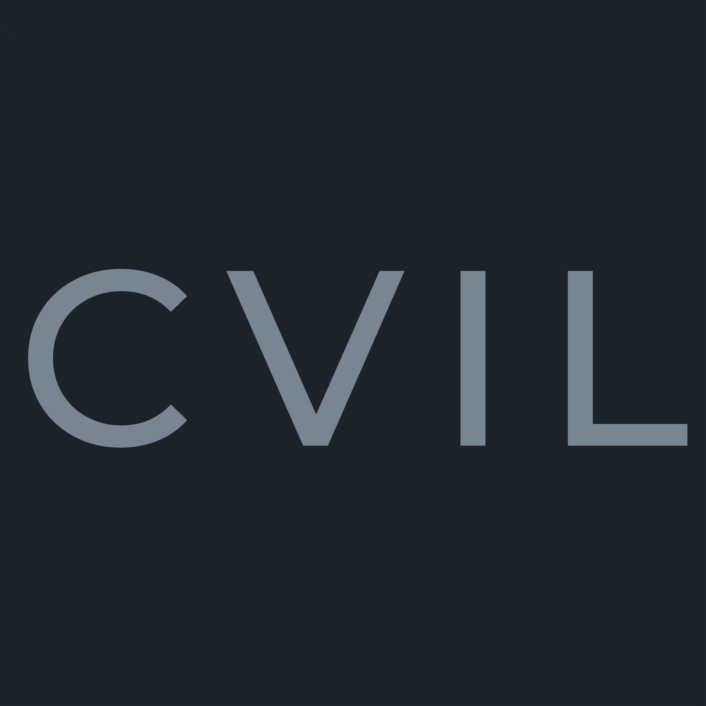

  

# CVIL: Computer Vision Interview List

I built this checklist while grinding through prep for a computer vision internship. A few months later I landed the role after a pretty rigorous interview process. Now I'm sharing it openly so others in the same boat don't have to start from zero.

**Keep it CVIL.**

---

## What This Is

A focused, phase-by-phase map of the topics that actually come up in CV/ML interviews... from core math all the way to deployment and specialization areas.

It's deliberately **not** a textbook or another giant paper list. It's a practical checklist that tells you *what* to study and in what order, so you can pair it with your own resources (courses, papers, videos) and track real understanding.

**[→ Open the full checklist](./computer-vision-interview-list.md)**

## What's Inside

- **Core Phases (1-5)**: Math & stats, CNNs, Transformers/ViTs, Object Detection (YOLO deep dive), and Tracking.
- **Specialization Tracks**: Person Re-Identification (ReID), Deployment & Production CV, Segmentation, OCR, and Vision-Language Models (VLMs)... more coming.
- Consistent emphasis on intuition, tradeoffs, and evolution of ideas.

## How I Used It

I went phase by phase, making sure I could explain not just *what* something is, but *why* it exists, what problem it solved, and what tradeoffs it introduced. It helped me stay organized and confident during interviews.

Feel free to move at your own pace... some people crush it in a few intense weeks, others spread it out while building projects.

## Contributing

This started as one person’s prep notes. It can grow into a proper community reference.

New specialization tracks (Pose Estimation, 3D Vision, Video Understanding, etc.) are very welcome. Please open an issue first to discuss scope before submitting a PR.

Full contributing guidelines are in [CONTRIBUTING.md](./CONTRIBUTING.md).

---

*Built by someone who was exactly where you are. Star it if it helps, fork it if you improve it, and keep it CVIL.*